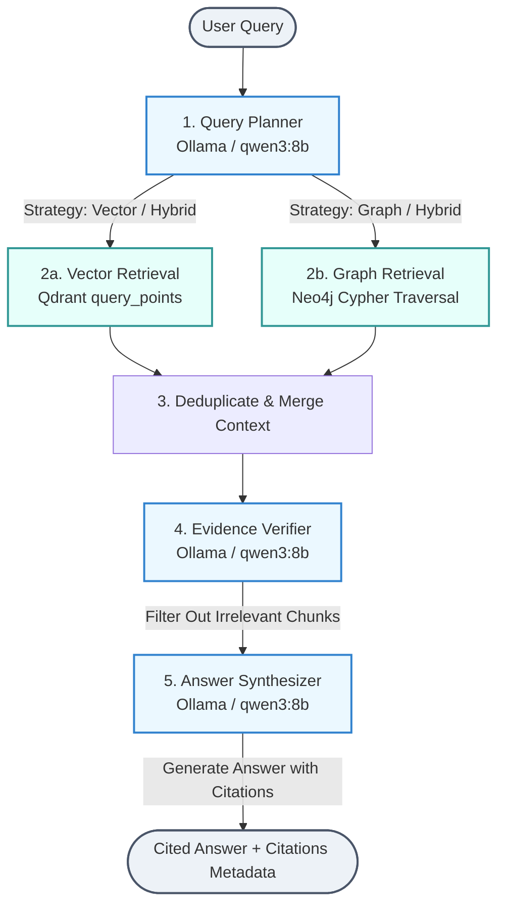

# Knowledge Detective

Knowledge Detective is a local ingestion and analysis engine designed to build a real-time semantic knowledge graph from project documents, meeting transcripts, emails, and commits. It combines vector databases, graph databases, and local LLMs to enable hybrid (semantic + structural) reasoning.

## 🛠️ Architecture

*   **Neo4j** (Graph Database): Stores structural relationships (e.g., who attended which meetings, who authored which commits, document references, and extracted topic/entity links).
*   **Qdrant** (Vector Database): Stores semantic text chunks and embeddings for fast semantic similarity search.
*   **Ollama** (Local LLM): Runs `qwen3:8b` (or other models) locally to extract entities, relationships, and topics from text chunks in structured JSON.
*   **Python Pipeline**: Handles recursive text splitting, embedding generation, dynamic identity resolution, and Neo4j/Qdrant ingestion.

---

## 🚀 Getting Started

### Prerequisites
*   [Docker & Docker Compose](https://www.docker.com/)
*   [Ollama](https://ollama.com/) (installed on the host machine)

### 1. Launch the Databases
Start Neo4j and Qdrant in the background:
```bash
docker compose up -d
```

### 2. Set Up Ollama
1. Open a terminal on your host machine and ensure the Ollama service is running.
2. Pull the default extraction model:
   ```bash
   ollama pull qwen3:8b
   ```
   *(Note: You can pull other models like `llama3.2` and update `OLLAMA_MODEL` in configuration if you are running on CPU and need faster extraction).*

### 3. Build the Backend Image
Build the backend container (caches the heavy dependencies like PyTorch and Sentence-Transformers):
```bash
docker compose build backend
```

### 4. Run the Bulk Ingestion Pipeline
To ingest all synthetic files under `test-data/` into Qdrant and Neo4j, run:
```bash
docker compose run --rm backend
```

### 5. Run the Reasoning Query Engine (Hybrid RAG)
To run Q&A tests against the ingested data, run:
```bash
docker compose run --rm backend python backend/scripts/test_query.py
```

---

## 🧠 Reasoning Query Engine (Hybrid RAG)

The Query Engine processes natural language questions using a multi-stage pipeline combining semantic search and relationship traversals.



### Flow Breakdown:
1. **Query Planner**: The LLM decomposes the user question into sub-queries, extracts candidate entities/topics, and decides the query routing strategy:
   - `vector`: Conceptual information (searches Qdrant).
   - `graph`: Relational/structural traversals (searches Neo4j).
   - `hybrid`: Combines both paths.
2. **Hybrid Retrieval**:
   - **Vector Path**: Computes text embeddings using local `all-MiniLM-L6-v2` and queries Qdrant via `.query_points()`.
   - **Graph Path**: Traverses Neo4j for nodes matching the query plan's entities and topics, pulling their corresponding full text chunks.
3. **Merge & Deduplicate**: Consolidates results based on unique `chunk_id` values.
4. **Evidence Verifier**: The LLM screens retrieved chunks, dropping irrelevant text blocks to avoid context bloating and hallucination.
5. **Answer Synthesizer**: The LLM compiles the final user-facing response, embedding inline citations `[Source: Document Title]` linked to source document metadata.

---

## 🔍 Exploring the Data

### Interactive Neo4j Graph
Go to [http://localhost:7474](http://localhost:7474) and log in:
*   **Authentication type**: `Username / Password`
*   **Username**: `neo4j`
*   **Password**: `password123`

**Try this query to view the graph:**
```cypher
MATCH (n) RETURN n LIMIT 150
```

### Qdrant Vector Dashboard
To inspect the stored vector points and collection configuration, navigate to:
```text
http://localhost:6333/dashboard
```

---

## 📂 Project Directory Structure

```text
├── backend/
│   ├── Dockerfile                 # Layer-cached development container
│   ├── requirements.txt           # Main python dependencies
│   ├── requirements-light.txt     # Light setup requirements
│   ├── app/
│   │   ├── config.py              # Environment configuration loader
│   │   ├── connectors/            # Gmail, Calendar, GitHub, Local filesystem connectors
│   │   └── ingestion/             # Text chunking, Embedding, LLM metadata extraction, Graph building
│   └── scripts/                   # Integration test scripts and database wiping utilities
├── docker-compose.yml             # Orchestration for Qdrant, Neo4j, and Backend dev container
└── test-data/                     # Synthetic emails, meeting transcripts, and project ADR documents
```

---

## 💡 Dynamic Identity Resolution
The pipeline resolves developer identities (e.g. mapping `sailesh3000` or `chandrasailesh30@gmail.com` to the canonical `Sailesh` node) database-side. It maintains an `aliases` array property on the `Person` node in Neo4j, matching incoming events dynamically so no static mappings are hardcoded in python files.
